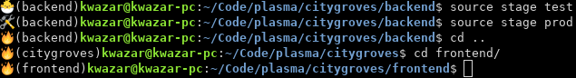

===============================================
Plasma - Personal Monorepo
===============================================

What is the monorepo?
---------------------
Monorepo is a software engineering strategy where code for many project
are stored in a single repository.

Why did I chose this strategy?
--------------------------------
I have learned in my engineering practice to follow "KISS principle" (keep it stupid simple).
Monorepo approach ticks almost all the boxes when it comes to simplicity and productivity.
I have worked in projects that used monorepo and splits repo approach and learned that overhead of managing split repos
is something that I want to avoid.

Folder structure
################
Monorepo does not mean the code is a monolith in fact it still should be modular.

::

    plasma[MONOREPO]/
    ├── comm[COMM]/   # Monorepo wise common code.
    │   ├── bash/  # Bash scripts.
    │   ├── python/  # Python libraries and helpers.
    │   ├── bin/  # Common binaries.
    │   └── docker/  # Common Dockerfiles, dockers scripts.
    ├── citygroves[PROJECT]/  # Property management website.
    |   ├── comm[COMM]/   # Project wise common code
    |   |   │   ├── bash/  # Bash scripts.
    |   |   │   ├── python/  # Python libraries and helpers.
    |   |   │   ├── bin/  # Common binaries.
    |   |   │   └── docker/  # Common Dockerfiles, dockers scripts.
    │   ├── bin/  # Miscellaneous executables. Added to the PATH env var in .evnrc shell script.
    │   ├── envs/  # Kubernetes config files for different environments.
    │   ├── doc/  # Documentation.
    │   ├── backend[APP]/  # Application (microservice).
    │   |   ├── bin/ # Miscellaneous executables. Added to the PATH env var in .evnrc shell script.
    |   |   ├── flesh/ # Source code. This is what goes into a docker container.
    |   |   ├── chart/ # Kubernetes helm chart.
    |   |   ├── values/ # Kubernetes values files for all the stages.
    |   |   |   ├── test/ # Kubernetes helm chart.
    |   |   |   |   ├── postgresql.yaml
    |   |   |   |   ├── redis.yaml
    |   |   |   |   └── backend.yaml
    |   |   |   ├── local/ # Kubernetes helm chart.
    |   |   |   ├── stage/ # Kubernetes helm chart.
    |   |   |   └── prod/ # Kubernetes helm chart.
    |   |   ├── .envrc/  # Direnv shell script.
    |   |   ├── __init__.py  # Contains deploy and delete methods.
    |   |   ├── dep.py  # deploy all the applications.
    |   |   └── del.py  # delete all the applications (except ).
    |   └── frontend[APP]/  # Application (microservice).
    │   ├── .envrc/  # Direnv shell script.
    |   ├── __init__.py  # Contains deploy and delete methods.
    |   ├── dep.py  # deploy all the applications.
    |   └── del.py  # delete all the applications (except persistent volumes).
    └── shangren[PROJECT]/  # Cryptocurrency auto trading bot.

Workflow
--------
I used direnv to setup environment depending of the developer current working directory.

For instance, when a developer is currently in :code:`./plasma/citygroves/backend`, :code:`PROJECT_NAME` and :code:`APP_NAME`
environmental variables are set accordingly. Moreover :code:`(backend)` will be added to the shell prompt.

Stages
######
Current stage can be changed using :code:`source stage local`. This will change kubernetes context to according cluster.
All of the comands will be run against this stage. For example. Running :code:`terminal` command will open a
terminal to a pod for the current stage.
Current stage is indicated by emoji in the shell prompt.

::

    🛠️ test
    🐣 local
    🤖 staging
    🔥 productions

Example:

Starting things up
##################
.. code-block:: console

    docker-compose up -d

Logging into microservices
################################
.. code-block:: console

    ./bin/terminal

The code is synchronised between a docker container and the host using volumes so any changes ( ``pipenv install`` etc ) will be affected on the host.
