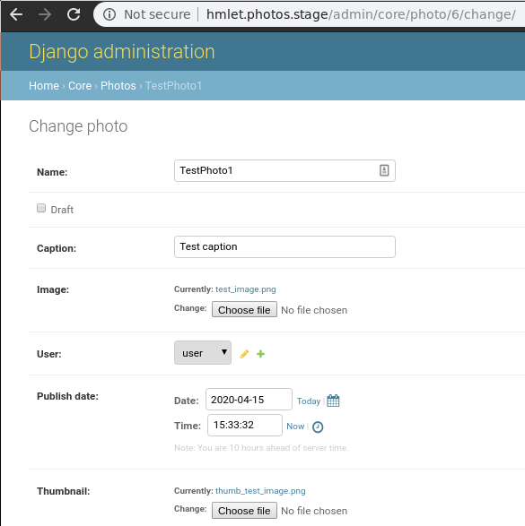

===============================================
Hmlet Photos - Take Home Project
===============================================

Design decisions
----------------
Devops is entirely handled in python and I used monorepo approach to
reuse as much code as possible.
I have been implementing this methodology as a side project and planning to publish a
package when finished. It is quite usable currently and saved me a lot of time
during implementing this project.

For deployment to local, test and staging environments I have chosen to use Kubernetes
because of it's seamless workflow.
Local and test clusters are deployed localy to KIND (Kubernetes in Docker) clusters.
Interaction between python devops scripts and clusters is achieved using kubectl,
helm, skaffold and telepresence.

As a storage I chose Minio which is compatible with S3 and is served inside the kubernetes cluster and
I chose Postresql as a database engine for all the environments. Unit tests are run on
SQLite because of speed benefits (when run locally)

Code Highlighs
##############
| Django app root: https://gitlab.com/damian.krystkiewicz/plasma/-/tree/master/hmlet/photos/flesh
| Api client Source code: https://gitlab.com/damian.krystkiewicz/plasma/-/blob/master/hmlet/comm/python/ht/api_clients/photos.py
| E2E test source code: https://gitlab.com/damian.krystkiewicz/plasma/-/blob/master/hmlet/tests/test_e2e/test_all.py
| unit tests source code: https://gitlab.com/damian.krystkiewicz/plasma/-/blob/master/hmlet/photos/flesh/tests/core/test_views.py

What is the monorepo?
---------------------
Monorepo is a software engineering strategy where code for many project
are stored in a single repository.

Why did I chose this strategy?
--------------------------------
I have learned in my engineering practice to follow "KISS principle" (keep it stupid simple).
Monorepo approach ticks almost all the boxes when it comes to simplicity and productivity.
I have worked in projects that used monorepo and splits repo approach and learned that overhead of managing split repos
is something that I want to avoid.

Folder structure
################
Monorepo does not mean the code is a monolith in fact it still should be modular.

::

    plasma[MONOREPO]/
    ├── comm[COMM]/   # Monorepo wise common code.
    │   ├── bash/  # Bash scripts.
    │   ├── python/  # Python libraries and helpers.
    │   ├── bin/  # Common binaries.
    │   └── docker/  # Common Dockerfiles, dockers scripts.
    ├── hmlet[CLUSTER]/  # Take home project.
    │   ├── .bin/  # Miscellaneous executables. Added to the PATH env var when shell.py is activate.
    │   ├── .deps/  # External dependencies like kubectl or helm downloaded during bootstrap
    |   ├── comm[COMM]/   # Project wise common code
    │   ├── envs/  # Kubernetes config files for different environments.
    │   ├── doc/  # Documentation.
    │   ├── photos[APP]/  # Photos application.
    │   |   ├── .bin/ # Miscellaneous executables. Added to the PATH env var in .evnrc shell script.
    |   |   ├── flesh/ # Source code. This is what goes into a docker container.
    |   |   ├── chart/ # Kubernetes helm chart.
    |   |   ├── values/ # Kubernetes values files for all the stages.
    |   |   |   ├── test/
    |   |   |   |   ├── postgresql.yaml
    |   |   |   |   ├── redis.yaml
    |   |   |   |   └── backend.yaml
    |   |   |   ├── local/
    |   |   |   ├── stage/
    |   |   |   └── prod/
    |   |   ├── app.py  # Command line utility that implements app wise devops functions like deployment
    |   |   └── shell.py  # Spawns a shell with prepared environmental variables and settings for a given stage
    |   ├── frontend[APP]/  # Application (microservice).
    |   ├── env_comm.py  # common environment settings
    |   ├── env_local.py  # local environment settings subclasses from common ones
    |   ├── env_stage.py  # staging environment settings subclasses from common ones
    |   ├── cluster.py  # Command line utility that implements cluster wise devops functions like deployment
    |   └── shell.py  # Spawns a shell with prepared environmental variables and settings for a given stage
    └── shangren[CLUSTER]/  # Cryptocurrency auto trading bot.
    └── citygroves[CLUSTER]/  # Property management tool

Workflow
--------
Design of this monorepo and clusters (projects) is compliant with the 12-factor app concept.
Each stage or module is configured using environmental variables generated using python command
line utily :code:`"./shell.py {stage}"`
An example flow would be as follows:

.. code-block:: console

    user@pc:/plasma$ ./shell.py
    (pl)user@pc:/plasma$ pl.bootstrap
    (pl)user@pc:/plasma$ cd hmlet
    (pl)user@pc:/plasma/hmlet$ ./shell.py local  # activates local environment
    🐣(ht)user@pc:/plasma/hmlet$ ./cluster.py python bootstrap_local_dev  # install dependencies as helm or kubectl
    🐣(ht)user@pc:/plasma/hmlet$ ./cluster.py bootstrap  # bootstraps local kubernetes in docker (kind) cluster
    🐣(ht)user@pc:/plasma/hmlet$ ./cluster.py deploy  # deploy all apps
    🐣(ht)user@pc:/plasma/hmlet$ ./cluster.py add_hosts  # add hosts to /etc/hosts file
    🐣(ht)user@user:/plasma/hmlet$ cd photos
    🐣(ht)user@user:/plasma/hmlet/photos$ ./shell.py local
    🐣(ps)user@user:/plasma/hmlet/photos$ ./app.py skaffold

Stages
######
Current stage can be changed using :code:`"./shell.py {stage}"`. This will change kubernetes context and
environmental variables to according cluster.
Environments are configured in env_*.py files and available from python code as a regular package or
environmental variables
All of the comands will be run against this stage. For example. Running :code:`./app.py terminal` command will open a
terminal to a pod for the current stage.
Current stage is indicated by emoji in the shell prompt.

::

    🛠️ test
    🐣 local
    🤖 staging
    🔥 productions

| Current app or cluster is indicated using two letter code in parenthesis.
| In instance (ht) - hmlet cluster, (ps) - photos app.

Requirements
############
The only dependency needed is Docker, other tools or libraries are downloaded during bootstrap.

Staging and testing
###################
Staging environment has been deployed to a AWS kubernetes cluster and is available publicly.

| http://18.138.187.28  # The Django app
| http://13.250.174.103  # The minio server

| Django admin logins:
| username: admin
| password: admin

| Minio logins:
| AccessKey: AccessKey
| SecretKey: SecretKey

| Uploaded image:
| http://13.250.174.103/media/thumb_test_image_QkUriGG.png

Services can also be accessed using hostnames after running :code:`./shell.py stage` and :code:`./cluster add_hosts`

| http://hmlet.photos.stage  # The Django app
| http://hmlet.minio.stage  # The minio server

API client
##########
In order to ease testing and further development an api client has been implemented.

Example end to end test would be as follows:

.. code-block:: python

    from ht.api_clients.photos import Photo

    def test_creating_deleting_listing(env, photos_api_client):
        to_del_photos: List[Photo] = photos_api_client.photos.list()

        # delete existing
        for p in to_del_photos:
            photos_api_client.photos.delete(p)

        assert len(photos_api_client.photos.list()) == 0

        photo_to_create1 = Photo(name="TestPhoto1",
                                 draft=False,
                                 caption="Test caption1",
                                 image=str(env.root / "tests/test_e2e/data/test_image.png"))
        photos_api_client.photos.create(photo_to_create1)

        photo_to_create2 = Photo(name="TestPhoto2",
                                 draft=True,
                                 caption="Test caption2",
                                 image=str(env.root / "tests/test_e2e/data/test_image.png"))
        photos_api_client.photos.create(photo_to_create2)

        fetched_photos: List[Photo] = photos_api_client.photos.list()
        fetched_photo1: Photo = fetched_photos[0]
        assert fetched_photo1.name == photo_to_create1.name

        fetched_photo2: Photo = fetched_photos[1]
        assert fetched_photo2.name == photo_to_create2.name

        assert len(fetched_photos) == 2

Manual testing results
######################
After running above code 2 photos are created.
Only thumbnail photos are served.

    Images are being uploaded to the minio server

    Photos are being created in django app

    Photo details

    Photos fetched using the api client

CI
##
Linters as well tests have been added to the CI.
